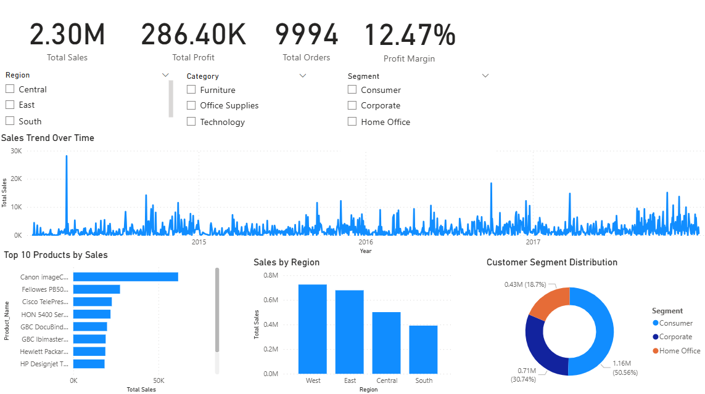
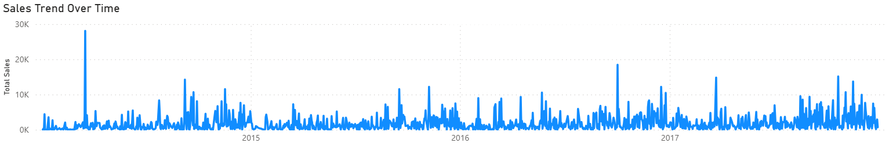
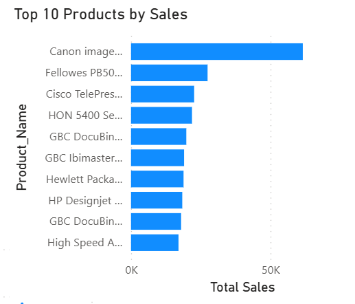

# 📊 Sales & Customer Insights Dashboard

## 📌 Overview

This project analyzes sales performance, profitability, customer segmentation, and regional trends using SQL Server and Power BI. The dashboard provides actionable insights into business performance and supports data-driven decision-making.

---

## 🛠️ Tools Used

- SQL Server
- Power BI
- Power Query
- Microsoft Excel

---

## 📊 Dashboard Features

- KPI cards for Total Sales, Total Profit, Total Orders, and Profit Margin
- Sales trend analysis over time
- Top-performing product analysis
- Regional sales comparison
- Customer segment distribution analysis
- Interactive filtering and slicers

---

## 💡 Key Insights

1. The West region generated the highest total sales among all regions.
2. A relatively small group of products contributed a significant portion of overall revenue.
3. Technology products demonstrated strong sales performance and profitability.
4. Customer purchasing behaviour differed across segments, with Consumer customers contributing the largest share of sales.
5. Regional performance differences suggest opportunities for targeted sales and marketing strategies.

---

## 📈 Business Value

This dashboard helps stakeholders monitor sales performance, evaluate profitability, identify top-performing products, and support strategic business decisions.

---

## 📷 Dashboard Screenshots

### Dashboard Overview


### Sales Trend Analysis


### Top Product Performance


---

## 📂 Project Structure

```plaintext
sales-customer-insights-dashboard/
│
├── superstore.csv
├── sales_analysis.sql
├── sales_dashboard.pbix
├── README.md
├── insights.txt
└── screenshots/
    ├── dashboard_overview.png
    ├── sales_trend.png
    └── top_products.png
```

## 🎯 Key Takeaway

This project demonstrates how SQL Server and Power BI can be used to uncover sales trends, evaluate profitability, and generate actionable business insights from transactional data.
